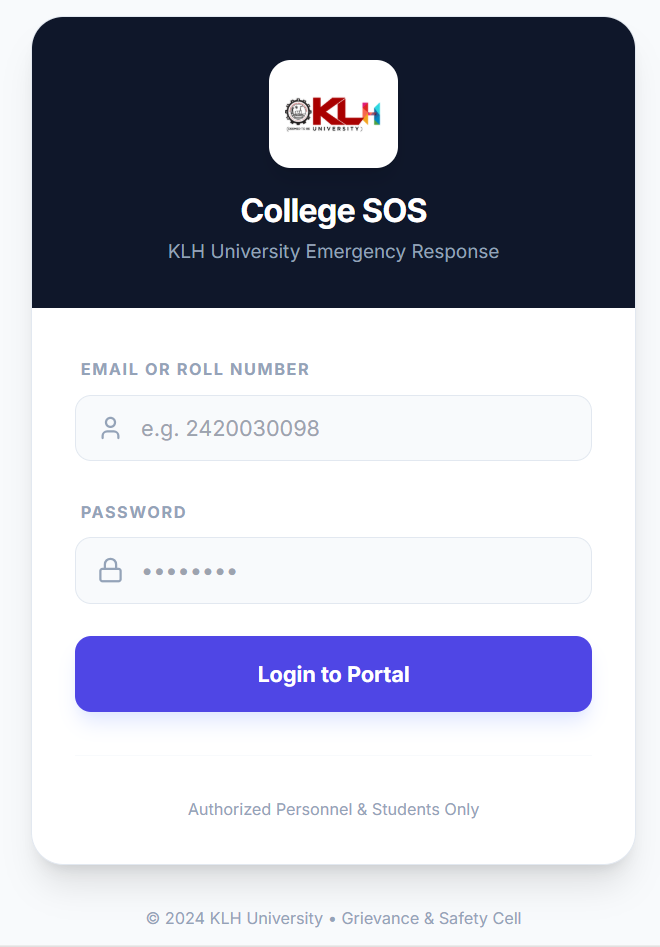
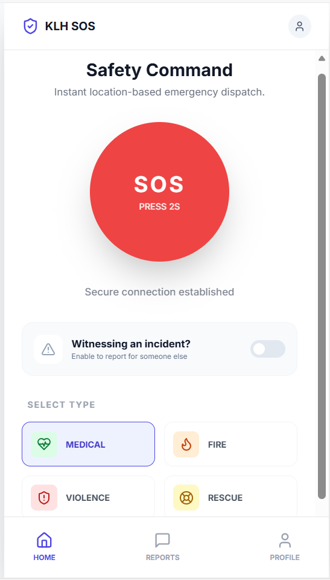
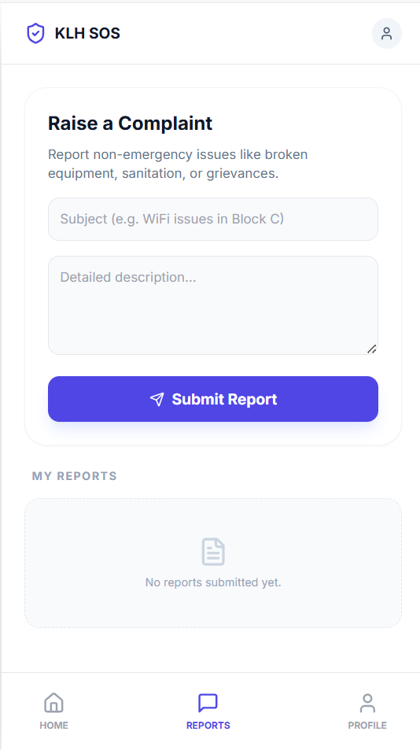
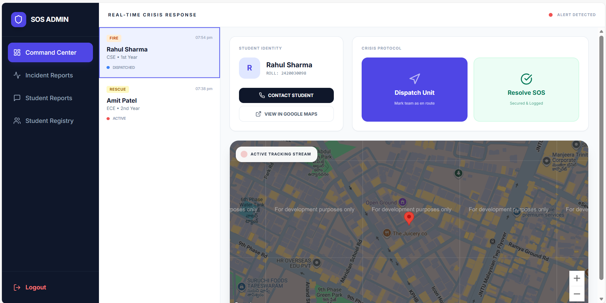
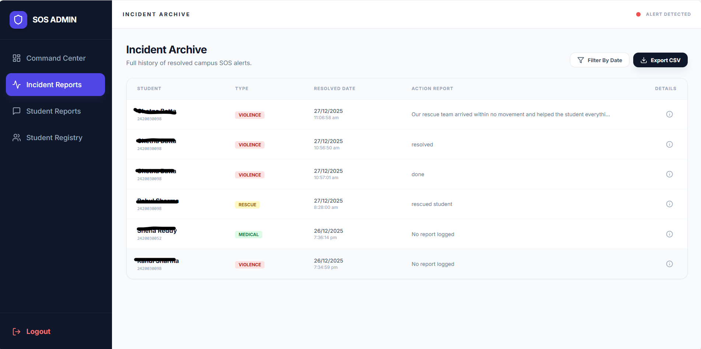
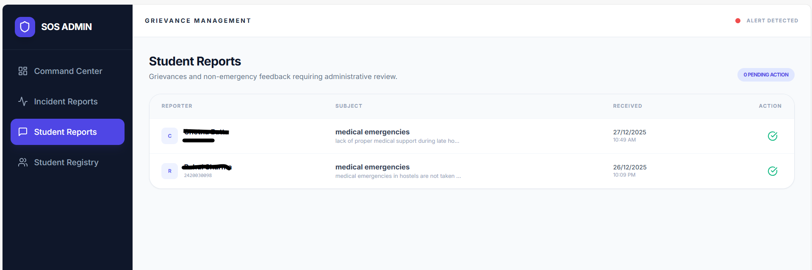
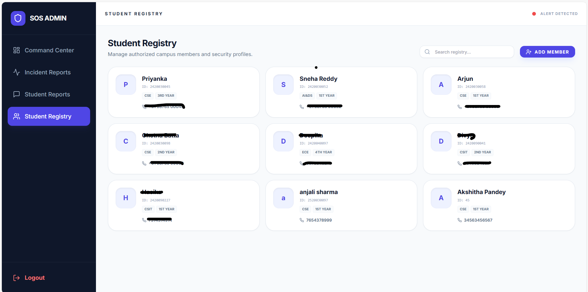

# 🚨 College SOS – Campus Emergency Response System
A real-time SOS emergency alert platform designed to improve campus safety by enabling students to instantly notify authorities with live location and emergency details.
---
## 💡 Problem Statement
In emergency situations on college campuses, delays in communication and location tracking can lead to serious consequences. Students need a fast, reliable, and easy-to-use system to seek help instantly.
--
## 🚀 Our Solution
College SOS provides a **one-tap emergency alert system** that sends real-time alerts with live location data to the admin dashboard, enabling faster and more effective emergency response.It also allows us to raise a complaint and for ever complaint and SOS the user will receive a reply from the admin
---
## ✨ Key Features
- One-tap SOS alert system  
- Emergency category selection (Medical, Fire, Violence, Rescue)  
- Raise Complaint easily with one tap
- Live location tracking using Google Maps  
- Real-time admin dashboard  
- Student identification (Name, Roll No, Branch, Year)  
- Clean, responsive UI 
---
## 🛠️ Tech Stack
- **Frontend:** HTML, CSS, JavaScript  
- **Backend / Database:** Firebase  
- **APIs:** Google Maps API  
- **Tools:** GitHub, VS Code  
---
## 🖼️ Youtube Link-: 
https://youtu.be/eu2Om3IXM7s

## 🖼️ Screenshots
### 🔐 Login Interface

### 🚨 SOS Alert Screen

### 🚨 Report Complaint

### 🧑‍💻 Admin Dashboard

---

---

---

---

---
## ⚙️ How It Works
1. Student logs into the system  
2. Presses SOS and selects emergency type  
3. Live location is captured automatically  
4. Alert is sent to the admin dashboard instantly  
5. Authorities respond without delay  
---

## 🎯 Impact
- Faster emergency response  
- Improved campus safety  
- Reduced communication gaps  
- Scalable for universities and institutions  
---

## 👩‍💻 Team / Author
**Chetna Chaudhary**  
B.Tech CSE  

---
Built as a hackathon project focusing on **real-world impact, simplicity, and rapid emergency response**.

## Run Locally

**Prerequisites:**  Node.js

1. Install dependencies:
   `npm install`

2. Run the app:
   `npm run dev`

DEMO USER CREDENTIALS-: 
User id:-45@klh.edu.in  
pass-demopass123

Admin credentials are confidential